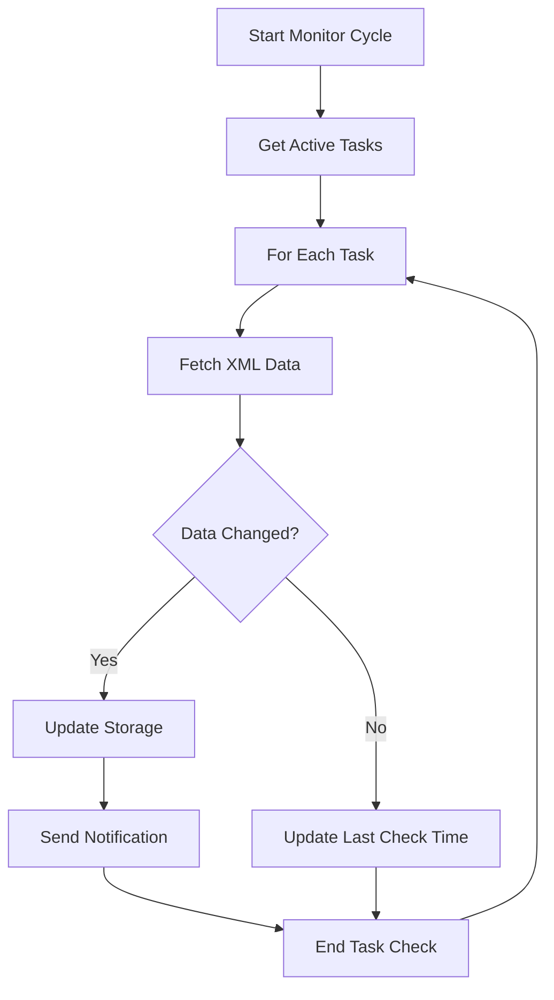
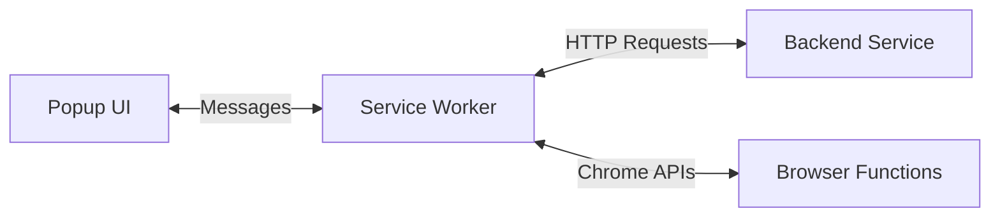
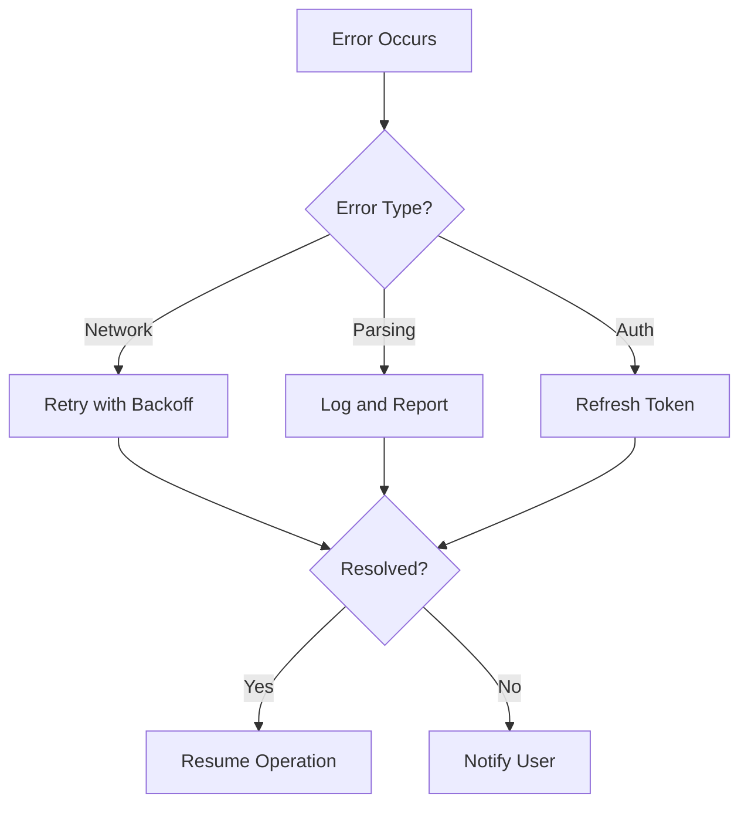

# Chrome Extension Background Service Worker - Detailed Explanation

## What is a Background Service Worker?
A background service worker is a script that runs in the background of a Chrome extension, separate from the popup UI or web pages. It remains active even when the extension popup is closed, making it perfect for:
- Continuous monitoring
- Handling notifications
- Managing state
- Processing background tasks
- Communicating with external services

## Key Functions in Our Jira Task Tracker

### 1. Task URL Detection and Processing
When a user visits a Jira task page, the service worker will:
- Detect if the current URL is a valid Jira task URL
- Convert the regular Jira URL to its XML endpoint version
- Validate the XML endpoint's accessibility
- Store the task information for monitoring

Example workflow:
1. Regular Jira URL:
   ```
   https://your-jira.com/browse/PROJECT-123
   ```
2. Converted XML URL:
   ```
   https://your-jira.com/si/jira.issueviews:issue-xml/PROJECT-123/PROJECT-123.xml
   ```

### 2. Periodic Monitoring System
The service worker implements a monitoring system that:
- Runs on a configurable interval (default: every 15 minutes)
- Fetches XML data for each tracked task
- Compares new data with previously stored values
- Triggers notifications for changes
- Handles errors and retries

Monitoring flow:


### 3. State Management
The service worker maintains the extension's state, including:
- List of monitored tasks
- Last known values for each task
- User preferences
- Authentication tokens
- Error logs

State persistence example:
```javascript
{
    tasks: {
        'PROJECT-123': {
            url: 'https://your-jira.com/browse/PROJECT-123',
            xmlUrl: 'https://your-jira.com/si/jira.issueviews:issue-xml/PROJECT-123/PROJECT-123.xml',
            lastCheck: '2024-03-10T15:30:00Z',
            status: 'active',
            lastValues: {
                status: 'In Progress',
                assignee: 'John Doe',
                // ... other tracked fields
            }
        }
        // ... other tasks
    },
    settings: {
        checkInterval: 900000, // 15 minutes in milliseconds
        notificationsEnabled: true,
        // ... other settings
    }
}
```

### 4. Communication Channels
The service worker manages three main types of communication:

1. **With Popup UI**
   - Task addition/removal requests
   - Status updates
   - Statistics requests
   - Settings changes

2. **With Backend Service**
   - XML data fetching
   - Data synchronization
   - Authentication
   - Error reporting

3. **With Chrome APIs**
   - Notification management
   - Tab management
   - Storage operations
   - Network requests

Communication flow:


### 5. Error Handling and Recovery
The service worker implements robust error handling:

1. **Network Errors**
   - Automatic retry with exponential backoff
   - Error logging
   - User notification for persistent issues

2. **XML Parsing Errors**
   - Validation of XML structure
   - Fallback mechanisms
   - Error reporting to backend

3. **Authentication Errors**
   - Token refresh attempts
   - User notification for re-authentication
   - Session management

Error handling flow:


### 6. Performance Considerations

1. **Memory Management**
   - Efficient state storage
   - Cleanup of old data
   - Resource optimization

2. **Battery Impact**
   - Adaptive monitoring intervals
   - Batch processing
   - Efficient network requests

3. **Data Caching**
   - Local storage of frequently accessed data
   - Cache invalidation strategies
   - Sync mechanisms

## Implementation Best Practices

### 1. Initialization
```javascript
// Service worker initialization sequence
1. Load stored state
2. Set up event listeners
3. Initialize authentication
4. Start monitoring system
5. Set up error handlers
```

### 2. Event Handling
```javascript
// Priority of events
1. Critical system events (auth, errors)
2. User-initiated actions
3. Monitoring tasks
4. Maintenance operations
```

### 3. Data Management
```javascript
// Data lifecycle
1. Validation of incoming data
2. Processing and transformation
3. Storage and caching
4. Cleanup and maintenance
```

## Security Considerations

1. **Data Protection**
   - Secure storage of sensitive information
   - Encryption of cached data
   - Secure communication channels

2. **Authentication**
   - Token-based authentication
   - Secure token storage
   - Regular token rotation

3. **Access Control**
   - Permission validation
   - URL pattern matching
   - API access control

This background service worker design provides a robust foundation for the Jira Task Tracker extension, ensuring reliable task monitoring, efficient communication, and proper error handling while maintaining good performance and security standards.

Would you like me to elaborate on any specific aspect of the background service worker? 