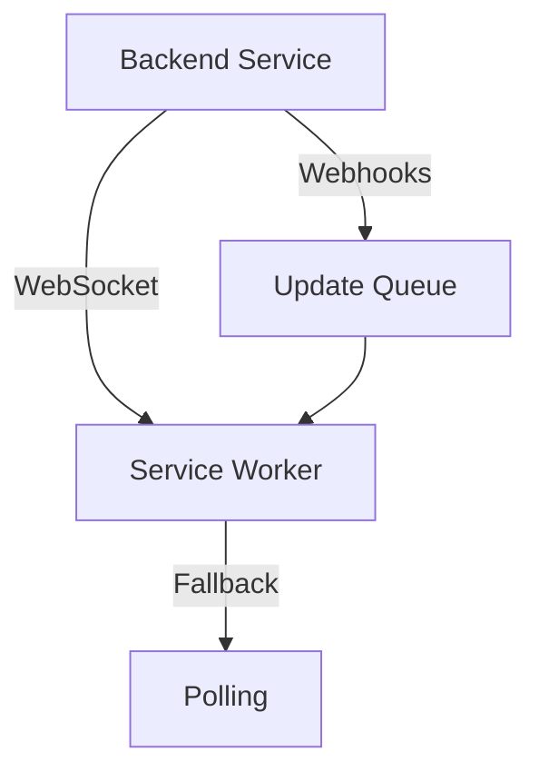

# Implementation Analysis and Alternatives

## Current Approach Review

### Strengths
1. **Continuous Monitoring**
   - Background service worker provides reliable monitoring
   - Efficient state management
   - Good error handling

2. **Architecture**
   - Clear separation of concerns
   - Well-structured communication channels
   - Robust error handling

### Potential Issues and Alternative Solutions

1. **Resource Usage Concerns**
   ✗ Current: Polling every 15 minutes for all tasks
   ✓ Better Alternatives:
   - Use WebSocket connections for real-time updates
   - Implement server-sent events (SSE)
   - Use Jira webhooks if available
   ```javascript
   // Example WebSocket implementation
   class JiraWebSocketMonitor {
       constructor() {
           this.ws = null;
           this.tasks = new Map();
       }

       connect() {
           this.ws = new WebSocket('wss://your-backend/jira-updates');
           this.ws.onmessage = (event) => {
               const update = JSON.parse(event.data);
               this.processUpdate(update);
           };
       }
   }
   ```

2. **Data Storage Strategy**
   ✗ Current: Storing all data in Chrome's local storage
   ✓ Better Alternatives:
   - Use IndexedDB for larger datasets
   - Implement data pagination
   - Store only essential data locally
   ```javascript
   // Example IndexedDB implementation
   class TaskStorage {
       async initialize() {
           this.db = await idb.openDB('JiraTracker', 1, {
               upgrade(db) {
                   db.createObjectStore('tasks', { keyPath: 'id' });
                   db.createObjectStore('updates', { keyPath: 'id' });
               }
           });
       }
   }
   ```

3. **Authentication Flow**
   ✗ Current: Token-based with periodic refresh
   ✓ Better Alternatives:
   - Implement OAuth 2.0 with PKCE
   - Use browser's identity API more effectively
   - Consider session-based authentication
   ```javascript
   // Example OAuth2 with PKCE
   class AuthenticationManager {
       async authenticate() {
           const codeVerifier = this.generateCodeVerifier();
           const codeChallenge = await this.generateCodeChallenge(codeVerifier);
           // Implement PKCE flow
       }
   }
   ```

4. **XML Processing**
   ✗ Current: Direct XML parsing
   ✓ Better Alternatives:
   - Use streaming XML parser for large files
   - Implement caching layer
   - Consider requesting JSON format if available
   ```javascript
   // Example streaming parser
   class XMLStreamProcessor {
       async processXMLStream(stream) {
           const parser = new SAXParser();
           return new Promise((resolve, reject) => {
               parser.onend = () => resolve(this.results);
               stream.pipe(parser);
           });
       }
   }
   ```

## Proposed Optimized Architecture

### 1. Hybrid Monitoring System


### 2. Progressive Data Loading
```javascript
class TaskManager {
    async loadTasks() {
        // Initial load of essential data
        const essentialData = await this.loadEssentialData();
        
        // Progressive loading of details
        this.loadDetailsInBackground(essentialData.ids);
        
        // Implement virtual scrolling for UI
        return essentialData;
    }
}
```

### 3. Intelligent Caching Strategy
```javascript
class CacheManager {
    constructor() {
        this.cache = new Map();
        this.priorities = new Map();
    }

    async get(key) {
        if (this.cache.has(key)) {
            const entry = this.cache.get(key);
            if (this.isStale(entry)) {
                return this.refresh(key);
            }
            return entry.data;
        }
        return this.fetch(key);
    }
}
```

## Recommendations for Improvement

1. **Real-time Updates**
   - Implement WebSocket connection for instant updates
   - Fall back to polling only when WebSocket fails
   - Use server-sent events as a middle ground

2. **Performance Optimization**
   - Implement request batching
   - Use web workers for heavy processing
   - Implement progressive loading

3. **Storage Optimization**
   - Use IndexedDB for large datasets
   - Implement data cleanup strategies
   - Use compression for stored data

4. **Error Resilience**
   - Implement circuit breaker pattern
   - Add retry queues
   - Better offline support

```javascript
class CircuitBreaker {
    constructor() {
        this.failures = 0;
        this.lastFailure = null;
        this.state = 'CLOSED';
    }

    async execute(fn) {
        if (this.state === 'OPEN') {
            if (this.shouldReset()) {
                this.reset();
            } else {
                throw new Error('Circuit breaker is OPEN');
            }
        }

        try {
            const result = await fn();
            this.success();
            return result;
        } catch (error) {
            this.failure();
            throw error;
        }
    }
}
```

## Conclusion

While the current implementation is solid, switching to a more event-driven architecture with:
- WebSocket/SSE for real-time updates
- IndexedDB for storage
- Progressive loading
- Circuit breaker pattern
- Intelligent caching

Would provide:
1. Better resource utilization
2. Faster updates
3. Improved reliability
4. Better offline support
5. Reduced server load

Would you like me to elaborate on any of these improvements or provide more specific implementation details for any component? 