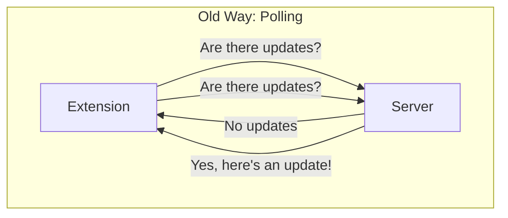
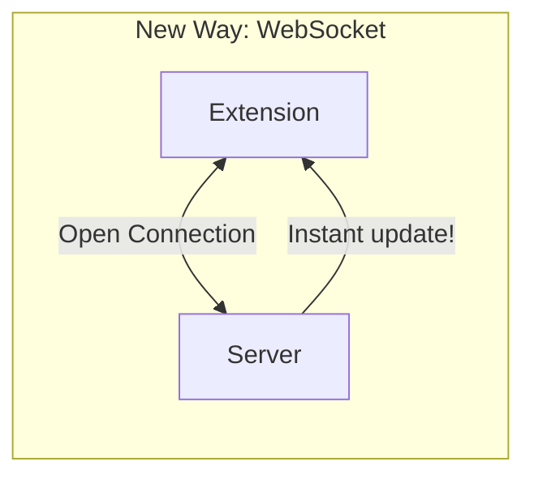

# Understanding WebSocket Connections in Jira Task Tracker

## What are WebSockets? 🤔

Think of WebSockets like a phone call between your Chrome extension and the server:
- Regular HTTP is like sending letters back and forth (polling every 15 minutes)
- WebSocket is like having an open phone line where both sides can talk instantly

### Visual Comparison

